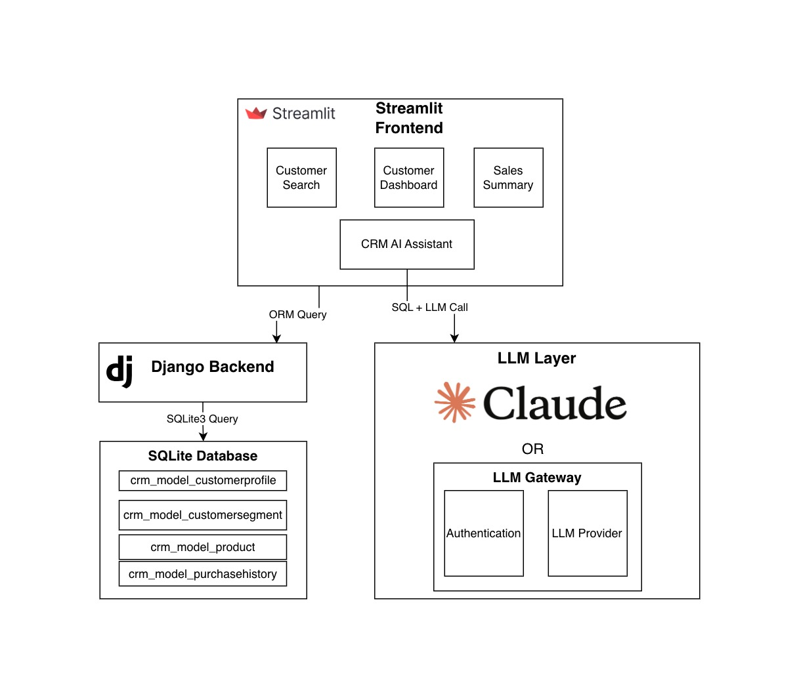
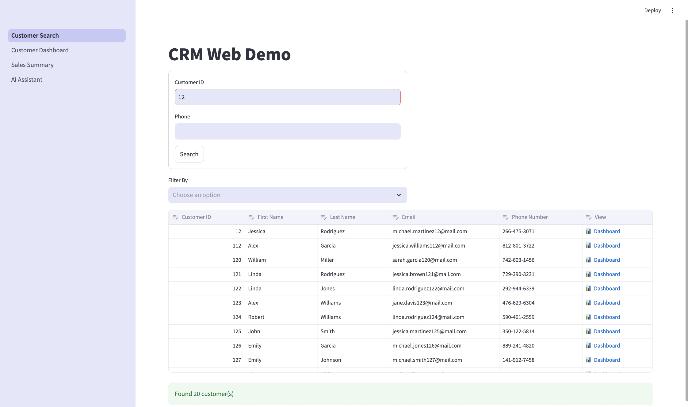
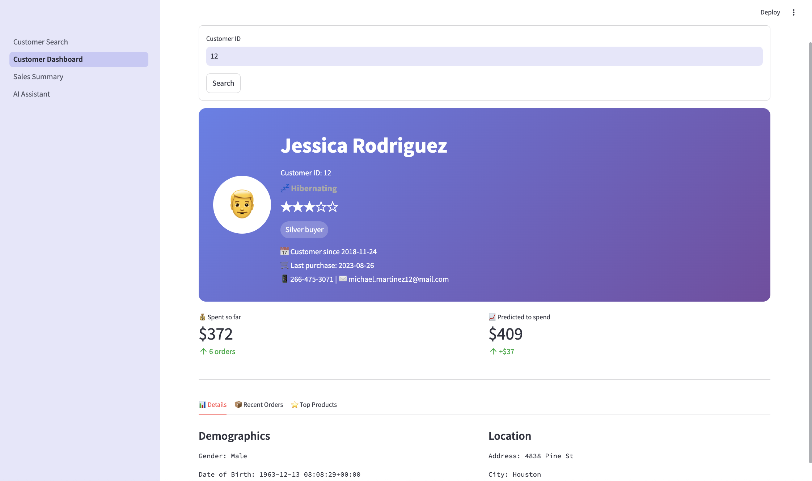
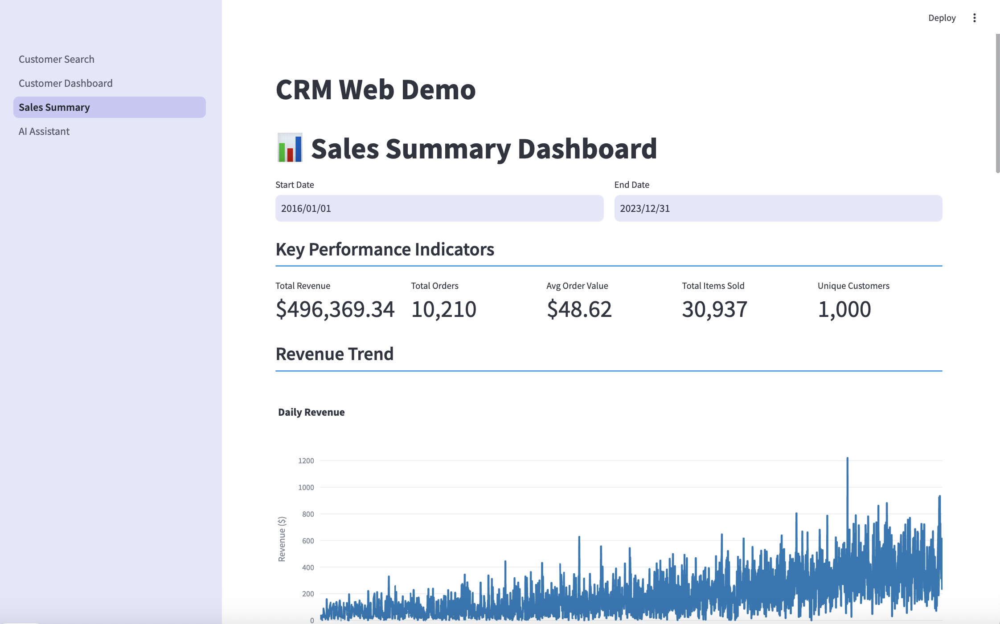
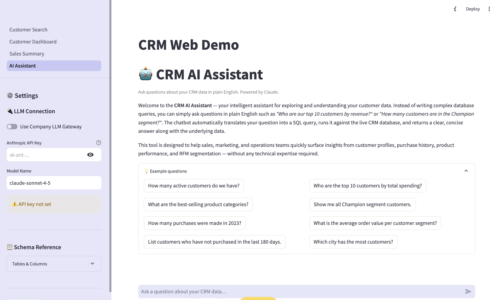
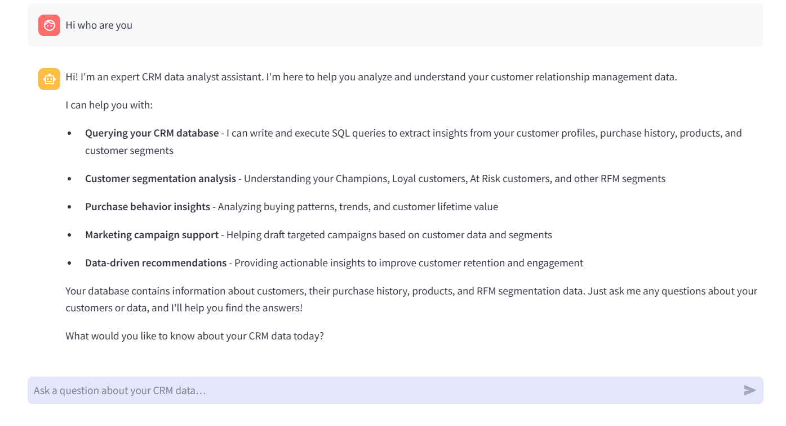
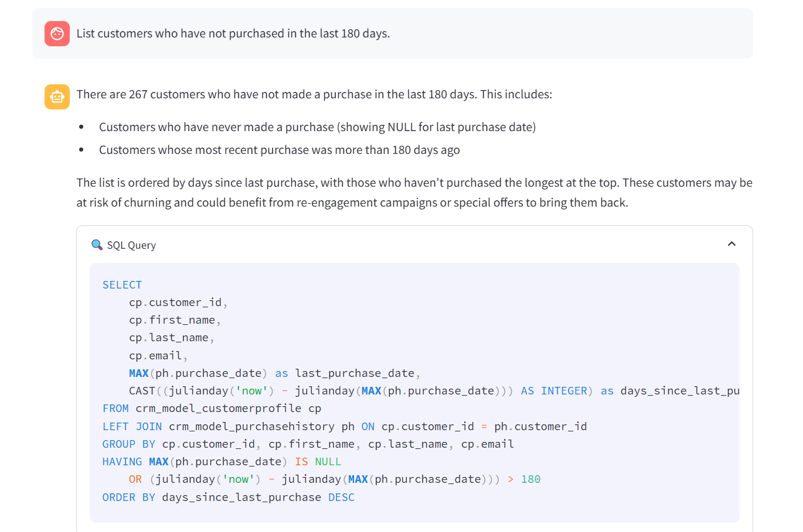
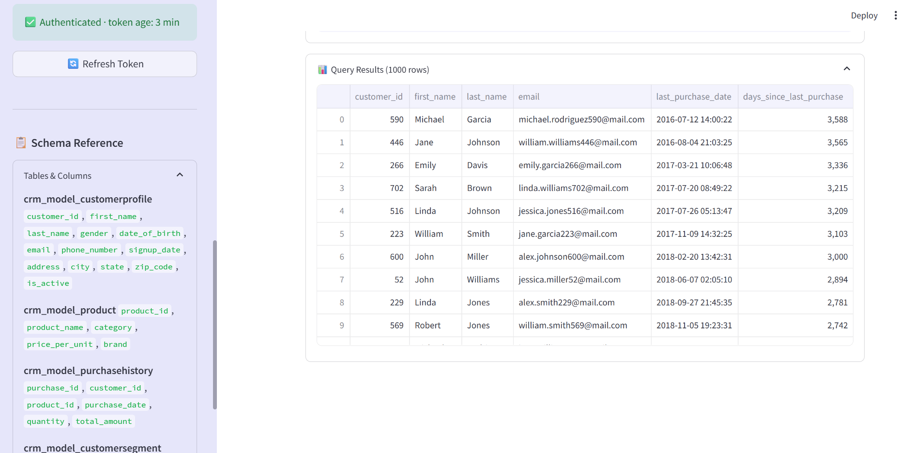
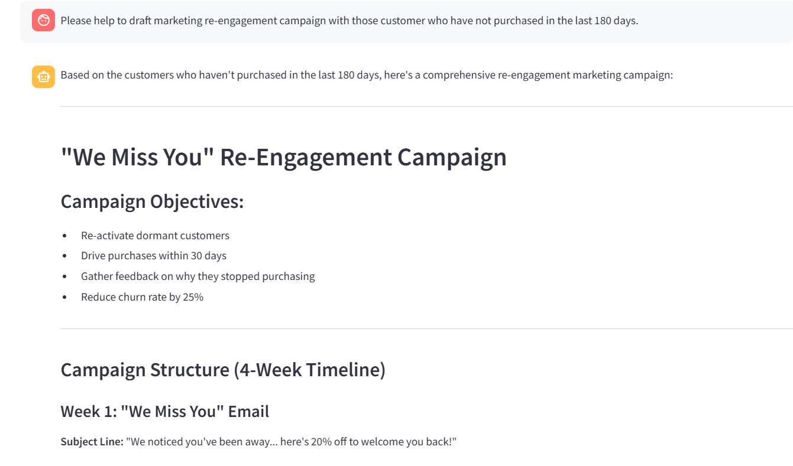

# CRM Web Application

This CRM demo built with Django backend and Streamlit frontend, all running within a single Python application.

This web app demontrates customer segmentation, RFM analysis, interactive dashboards and CRM AI Assistant.

## 🏗️ Architecture


## ✨ Features

- **Customer Search**: Search customers by ID, phone number, name, or email with fuzzy matching
- **Unified Customer Dashboard**: View detailed customer profiles with demographics, contact info, and purchase history. Customer segmentation based on Recency, Frequency, and Monetary values, scoring to classify customers, enabling targeted insights
- **Sales Analytics**: Interactive sales summary dashboard with key performance indicators
- **CRM AI Assistant**: An intelligent assistant for exploring and understanding your customer data. It translates natural language questions into accurate SQL queries against the CRM database, presents the results in a readable format. User can also ask any question aaginst the CRM and recommendation on sales and marketing. Defaults to the Claude model but can be configured to use a company LLM gateway.


## 🚀 Installation

### Prerequisites

- Python 3.11 or higher
- pip package manager

### Setup Steps

1. **Clone or download the project**
   ```bash
   cd streamlit-web-crm
   ```
2. **Create Python Virtual Environment (Recommended)**

3. **Install required packages**
   ```bash
   pip install -r requirements.txt
   ```

4. **Set up the database**
   ```bash
   cd backend_crm
   python manage.py makemigrations
   python manage.py migrate
   ```

5. **Import sample data (optional)**
   ```bash
   python manage.py import_csv_data --base-path ../kaggle_dataset
   ```
### Running the Application

1. **Start the Streamlit application** (from project root):
   ```bash
   streamlit run app.py
   ```
2. **Access the application**:
   - Open your browser and navigate to `http://localhost:8501`
   - The application will automatically configure Django settings

## 🛠️ Tech Stack

**Backend:**
- Django 5.2.8
- SQLite database
- Django ORM

**Frontend:**
- Streamlit
- Pandas for data manipulation
- Plotly for interactive visualizations

**Data Processing:**
- Python 
- Pandas
- CSV data imports (optional for smaple data)

## 📱 Application Pages

### 1. Customer Search
- Search customers by ID, phone number, name, or email
- Support for both exact and fuzzy matching
- Multi-field filtering capabilities
- Quick access to customer profiles
   

### 2. Customer Dashboard
- Comprehensive customer profile view
- Purchase history with metrics:
- RFM segment
  

### 3. Sales Summary
- Date range filtering for analysis
- Key Performance Indicators (KPIs):
- Interactive visualizations:
  - Daily/monthly revenue trends
  - Top products by revenue
  - Sales by category
  - Customer segment distribution
  - Product brand performance
  
 
### 4. CRM AI Assistant
- Translates user questions into SQL queries against
- Analyzes customer data and recommend marketing strategies






## 📊 Data Management

### Import CSV Data

The system supports bulk data import from CSV files:

```bash
cd backend_crm
python manage.py import_csv_data --base-path ../kaggle_dataset
```

Expected CSV files:
- `customer_profile_dataset.csv`: Customer demographic and contact information
- `products_dataset.csv`: Product catalog with prices and categories
- `purchase_history_dataset.csv`: Transaction history

### Reset Database

To clear all CRM data:

```bash
python manage.py reset_crm_data
```

## 🗄️ Database Models

### 1. CustomerProfile
Core customer information including demographics and contact details.

**Fields**: customer_id, first_name, last_name, gender, date_of_birth, email, phone_number, signup_date, address, city, state, zip_code, is_active

### 2. Product
Product catalog with pricing and categorization.

**Fields**: product_id, product_name, category, price_per_unit, brand, product_description

### 3. PurchaseHistory
Transaction records linking customers to products.

**Fields**: purchase_id, customer (FK), product (FK), purchase_date, quantity, total_amount

### 4. CustomerSegment
RFM analysis results for customer segmentation.

**Fields**: customer (OneToOne FK), recency_days, frequency, monetary, r_score, f_score, m_score, rfm_score, segment, last_calculated

**Segments include**: Champions, Loyal Customers, Potential Loyalists, Recent Customers, Promising, Need Attention, About To Sleep, At Risk, Can't Lose Them, Hibernating, Lost

## 📁 Project Structure

```
20251111-web-crm/
├── README.md                       # Project documentation
├── app.py                          # Main Streamlit application entry point
├── .streamlit/                     # Streamlit configuration directory
├── .venv/                          # Python virtual environment (gitignored)
├── .vscode/                        # VS Code workspace settings
├── backend_crm/                    # Django backend application
│   ├── __init__.py                 # Python package initializer
│   ├── manage.py                   # Django management script
│   ├── db.sqlite3                  # SQLite database file
│   ├── backend_crm/                # Django project configuration
│   │   ├── __init__.py             # Python package initializer
│   │   ├── settings.py             # Django settings and configuration
│   └── crm_model/                  # CRM Django application
│       ├── __init__.py             # Python package initializer
│       ├── models.py               # Database models (Customer, Product, Purchase, Segment)
│       ├── views.py                # Business logic and view functions
│       ├── admin.py                # Django admin panel configuration
│       ├── apps.py                 # Application configuration
│       ├── management/             # Custom Django management commands
│       │   └── commands/
│       │       ├── import_csv_data.py    # CSV data import command
│       │       └── reset_crm_data.py     # Database reset command
│       └── migrations/             # Database migration files
│           ├── __init__.py         # Python package initializer
│           ├── 0001_initial.py     # Initial database schema
│           └── 0002_customersegment.py   # CustomerSegment model migration
├── frontend_pages/                 # Streamlit page components
│   ├── 0_search_page.py            # Customer search interface
│   ├── 1_customer_dashboard.py     # Customer detail dashboard
│   └── 2_sales_summary.py          # Sales analytics and KPI dashboard
│   └── 3_ai_assistant.py            # CRM AI assistant  
└── kaggle_dataset/                 # Sample CSV data files
    ├── CRM_Performence_Dataset.csv # CRM performance metrics data
    ├── customer_profile_dataset.csv # Customer demographic data
    ├── products_dataset.csv        # Product catalog data
    └── purchase_history_dataset.csv # Transaction history data
```

## 🔧 Configuration

### Django Settings
Located in `backend_crm/backend_crm/settings.py`:
- Database: SQLite (default)
- Debug mode: Enabled (for development)
- Installed apps include: crm_model

### Streamlit Configuration
The application automatically:
- Sets page layout to 'wide' for better data visualization
- Configures page title as 'CRM'
- Manages navigation between multiple pages


## 📝 License

This project is for educational and demonstration purposes.

## 🐛 Troubleshooting

### Django Settings Module Not Found
The application automatically detects the Django settings module. If issues persist:
1. Ensure all `__init__.py` files exist in Django app directories
2. Verify `backend_crm/backend_crm/settings.py` exists

### Database Issues
Reset and recreate the database:
```bash
cd backend_crm
python manage.py migrate --run-syncdb
python manage.py import_csv_data --overwrite --base-path ../kaggle_dataset
```

### Import Errors
Ensure all dependencies are installed:
```bash
pip install django streamlit pandas plotly
```

## 📞 Support

For issues or questions, refer to:
- Django documentation: https://docs.djangoproject.com/
- Streamlit documentation: https://docs.streamlit.io/

## Dataset Credit
- https://www.kaggle.com/datasets/svbstan/sales-product-and-customer-insight-repository?select=purchase_history_dataset.csv

- https://www.kaggle.com/datasets/lastman0800/social-media-for-crm
